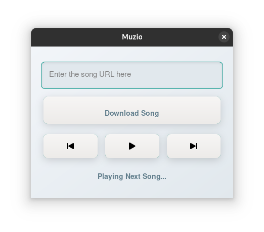

# Muzio - Music Player Application (ALPHA)

Muzio is a simple music player application developed using GTK and C. It allows users to download songs from URLs (YouTube) and play them in a circular queue. The application is designed to be straightforward and user-friendly.

## Features

- **Download Songs**: Users can input a song URL, and the application will download the song in MP3 format using `yt-dlp`.
- **Play Songs**: The application plays songs from a shuffled queue of downloaded songs.
- **Circular Queue**: Songs are managed using a circular queue, ensuring efficient memory usage and quick access to song playback.
- **Multithreading**: The application downloads songs in a separate thread, allowing the user interface to remain responsive.

## Dependencies

To build and run the application, ensure you have the following installed:

- GTK 3
- GLib
- `yt-dlp` for downloading songs
- VLC for playing songs (using `cvlc`)

## Build Instructions
### Clone or download the repository to your local machine.

- Navigate to the project directory.
- Compile the application using gcc:

```bash
gcc -o muzio muzio.c `pkg-config --cflags --libs gtk+-3.0` -lpthread
./muzio


